# 🃏 Black Jack Game

A classic command-line Blackjack (21) card game implemented in Python. Play against the dealer and test your luck and strategy!

## 📖 Table of Contents

- [About the Game](#about-the-game)
- [Features](#features)
- [Game Rules](#game-rules)
- [How to Play](#how-to-play)
- [Installation](#installation)
- [Code Architecture](#code-architecture)
- [Game Flow](#game-flow)
- [Class Diagram](#class-diagram)
- [Screenshots](#screenshots)
- [Contributing](#contributing)
- [License](#license)

## 🎰 About the Game

This is a text-based implementation of the popular casino card game Blackjack (also known as 21). The game allows you to play multiple rounds against a computer dealer, following standard Blackjack rules.

## ✨ Features

- 🎮 Play multiple games in a single session
- 🃏 Full 52-card deck with proper shuffling
- 🤖 Intelligent dealer AI (hits until 17)
- ♠️ Proper Ace handling (11 or 1)
- 🎯 Blackjack detection
- 📊 Hand value calculation
- 🔒 Hidden dealer card until reveal

## 📜 Game Rules

### Objective
Get a hand value as close to **21** as possible without going over (busting), while beating the dealer's hand.

### Card Values
| Card | Value |
|------|-------|
| 2-10 | Face value |
| J, Q, K | 10 |
| Ace | 11 (or 1 if hand would bust) |

### Winning Conditions
- **Blackjack**: Getting exactly 21 with your first two cards (Ace + 10-value card)
- **Beat the Dealer**: Have a higher hand value than the dealer without busting
- **Dealer Busts**: Dealer's hand exceeds 21

### Dealer Rules
- Dealer must hit on 16 or less
- Dealer must stand on 17 or more

## 🎮 How to Play

1. Enter the number of games you want to play
2. You'll receive two cards (both visible)
3. Dealer receives two cards (one hidden)
4. Choose your action:
   - **Hit (H)**: Take another card
   - **Stand (S)**: Keep your current hand
5. Try to get as close to 21 without going over
6. Dealer reveals their hand and plays
7. Winner is determined!

## 🚀 Installation

### Prerequisites
- Python 3.x installed on your system

### Steps

```bash
# Clone the repository
git clone https://github.com/MayankB1708/Black-Jack-Game.git

# Navigate to the directory
cd Black-Jack-Game

# Run the game
python main.py
```

## 🏗️ Code Architecture

The game is built using Object-Oriented Programming (OOP) principles with four main classes:

### Classes Overview

| Class | Purpose |
|-------|---------|
| `Card` | Represents a single playing card with suit and rank |
| `Deck` | Manages the 52-card deck, shuffling, and dealing |
| `Hand` | Handles player/dealer hands, calculates values |
| `Game` | Controls game flow and win/loss logic |

## 🔄 Game Flow

```mermaid
flowchart TD
    A[🎮 Start Game] --> B[Enter number of games]
    B --> C[Create & Shuffle Deck]
    C --> D[Deal 2 cards to Player]
    D --> E[Deal 2 cards to Dealer]
    E --> F{Check for Blackjack}
    
    F -->|Blackjack Found| G[Declare Winner]
    F -->|No Blackjack| H[Display Hands]
    
    H --> I{Player's Turn}
    I --> J{Hit or Stand?}
    
    J -->|Hit| K[Deal card to Player]
    K --> L{Player Busted?}
    L -->|Yes| M[Dealer Wins 😭]
    L -->|No| I
    
    J -->|Stand| N[Dealer's Turn]
    N --> O{Dealer < 17?}
    O -->|Yes| P[Deal card to Dealer]
    P --> Q{Dealer Busted?}
    Q -->|Yes| R[Player Wins 😀]
    Q -->|No| O
    
    O -->|No| S[Compare Hands]
    S --> T{Who has higher value?}
    
    T -->|Player| R
    T -->|Dealer| M
    T -->|Tie| U[It's a Tie 😑]
    
    G --> V{More games?}
    M --> V
    R --> V
    U --> V
    
    V -->|Yes| C
    V -->|No| W[🎮 Thanks for Playing!]
```



## 📊 Class Diagram


## 🔢 Sequence Diagram


## 🎯 State Diagram


## 📸 Sample Output

```
How many games do you want to play? 2

******************************
Game 1 of 2
******************************
Your hand:
7 of hearts
K of spades
Value: 17

Dealer's hand:
hidden
9 of diamonds

Please choose 'Hit' or 'Stand': s

Dealer's hand:
6 of clubs
9 of diamonds
3 of hearts
Value: 18

Final Results
Your hand: 17
Dealer's hand: 18
Dealer wins. 😭

******************************
Game 2 of 2
******************************
Your hand:
A of spades
K of hearts
Value: 21

Dealer's hand:
hidden
7 of clubs

You have blackjack. You win! 😀

Thanks for playing!
```

## 🤝 Contributing

Contributions are welcome! Here are some ways you can contribute:

1. 🐛 Report bugs
2. 💡 Suggest new features
3. 🔧 Submit pull requests

### Ideas for Future Enhancements
- [ ] Add betting system with chips
- [ ] Implement split and double down
- [ ] Add GUI using Tkinter or Pygame
- [ ] Implement multiplayer mode
- [ ] Add card counting statistics
- [ ] Save game history to file

## 📄 License

This project is open source and available under the [MIT License](LICENSE).

---

<div align="center">

**Made with ❤️ by [MayankB1708](https://github.com/MayankB1708)**

⭐ Star this repo if you found it helpful!

</div>